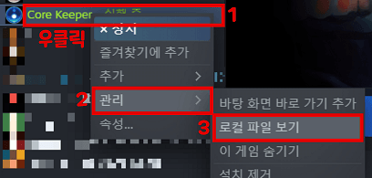

### 1. 설치 방법



1. 스팀 라이브러리 -> CoreKeeper 우클릭 -> 관리 -> 로컬 파일 보기

2. CoreKeeper_Data 폴더 이동 -> 압축 해제한 data.unity3d 덮어쓰기

### 2. 파일 경로:

```
SteamLibrary/steamapps/common/Core Keeper/CoreKeeper_Data/data.unity3d
```

### 3. 게임 실행:

옵션->언어를 클릭하여 한국어로 변경해줍니다.